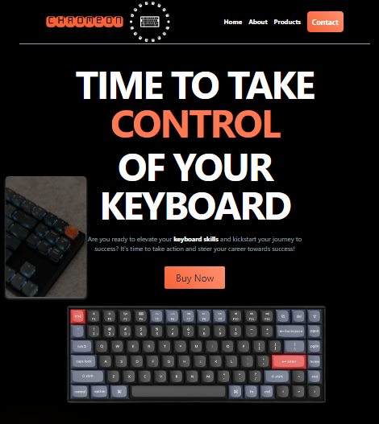

# CHROMEON - Online Store for Keyboards

CHROMEON is an online store specializing in the sale of high-quality computer keyboards. Our mission is to provide products that not only improve performance but also enhance the user experience.

## About the Project

CHROMEON is an e-commerce platform offering a wide selection of keyboards with various switch types and features. Our keyboards are designed to meet the expectations of both gaming enthusiasts and remote working professionals. We provide high-quality products that are durable and functional.

## Technologies

The project has been implemented using the following technologies:

- HTML5
- CSS3
- JavaScript
- React
- Tailwind CSS

## Installation

To install and run this project locally, follow these steps:

1. Clone the repository: git clone https://github.com/tomaszGrobelski/CHROMEON.git
2. Navigate to the project directory: cd CHROMEON
3. Install dependencies: npm install
4. Run the application: npm start

## Author

- Tomasz Grobelski - [GitHub]([link_do_profilu](https://github.com/TomaszGrobelski))

## Demo
[The CHROMEON website demo](https://tomaszgrobelski.github.io/CHROMEON/)
