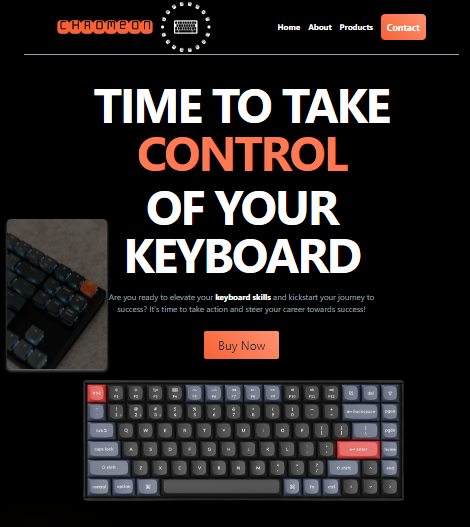

# CHROMEON - Sklep internetowy z klawiaturami

CHROMEON to sklep internetowy specjalizujący się w sprzedaży wysokiej jakości klawiatur do komputerów. Nasza misja polega na dostarczaniu produktów, które nie tylko poprawią wydajność, ale także poprawią doświadczenie użytkownika.

## O projekcie

CHROMEON jest platformą e-commerce, która oferuje szeroki wybór klawiatur o różnych typach przełączników i cechach. Nasze klawiatury są zaprojektowane tak, aby spełniać oczekiwania zarówno entuzjastów gamingu, jak i profesjonalistów pracujących zdalnie. Zapewniamy produkty wysokiej jakości, które są trwałe i funkcjonalne.

## Technologie

Projekt został zrealizowany przy użyciu następujących technologii:

- HTML5
- CSS3
- JavaScript
- React
- Tailwind CSS

## Instalacja

Aby zainstalować i uruchomić ten projekt lokalnie, wykonaj następujące kroki:

1. Sklonuj repozytorium: `git clone https://github.com/TWOJ_USERNAME/CHROMEON.git`
2. Przejdź do katalogu projektu: `cd CHROMEON`
3. Zainstaluj zależności: `npm install`
4. Uruchom aplikację: `npm start`

## Autorzy

- Tomasz Grobelski - [GitHub]([link_do_profilu](https://github.com/TomaszGrobelski))

## DEMO
